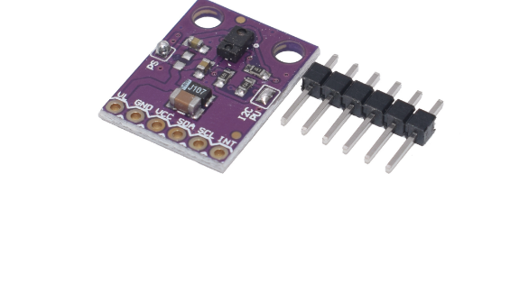

# SMAVI - Smart-Vivarium
Proyecto de vivarium. Usando  ESP32 junto a varios sensores, contectado a internet, te avisará si tiene una necesidad no satisfecha. 

<!--  -->
 

<!--  -->


<!-- ## Qué es
*This text will be italic*

> We're living the future so -->


## Lista de materiales necesarios

<!-- - 2 wemos d1 mini (esp8266) -->

imagen | Componente |  precio (u) | url
------- |------------- |------- | --------
 | 2x wemos d1 mini (esp8266) |  1,63€  | [Aliexpress](https://es.aliexpress.com/item/32958591238.html?spm=a2g0s.9042311.0.0.274263c01DRJqH)
 | 2x ventilador pc |  2,08€  | [Amazon](https://es.aliexpress.com/item/32958591238.html?spm=a2g0s.9042311.0.0.274263c01DRJqH)
 | 2x apds9966 |  1,06€  | [Aliexpress](https://es.aliexpress.com/item/4000051599173.html?spm=a2g0s.9042311.0.0.274263c0AyfmKo)
 | 2x bme280 5v |  1,67€  | [Aliexpress](https://es.aliexpress.com/item/32849462236.html?spm=a2g0s.9042311.0.0.274263c06IUh9i)


<!-- 1. Item 1
1. Item 2
1. Item 3
   1. Item 3a
   1. Item 3b -->
   
<!-- ## Aún pendiente (cosas que faltan):
- [x] @mentions, #refs, [links](), **formatting**, and <del>tags</del> supported
- [x] list syntax required (any unordered or ordered list supported)
- [x] this is a complete item
- [ ] this is an incomplete item -->


<!-- ## Esquema circuito


## Código y curiosidades 

```javascript
function fancyAlert(arg) {
  if(arg) {
    $.facebox({div:'#foo'})
  }
}
``` -->


## por redactar y ordenar
humedad, temperatura y presion ---> bme280
iluminacion, mas control de presencia mas colores --> APDS9960
rele con resistencia calefactora
rele con ventiladores
wifi para mandar información --> logeo.
si hay un dato erroneo o peligroso manda email


Control:
Humedad(ultrasonidos)
Iluminación (lámpara Led)
Temp (resistencia calefactora)
Ventilación (2 ventiladores)


:sunglasses:
